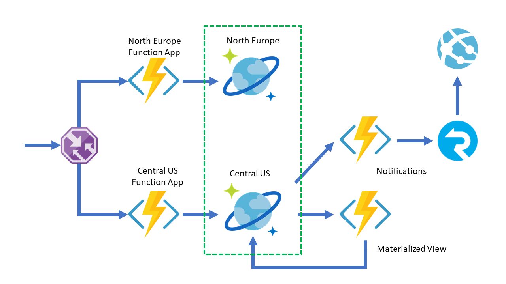

# Serverless geo-distributed event-based architecture with Azure Cosmos DB and Azure Functions

This repository contains a sample architecture that can be deployed across multiple regions and leverage Azure Cosmos DB's Multi master and Change feed features to achieve:

* Local writes on all Azure Function regions
* Real-time notifications provided by the Change feed
* Real-time data migration across Cosmos containers.

## Local writes

Multi Master enables all Azure Cosmos account regions to be read and write enabled. If you deploy an Azure Function App like the one in the [DistributedAPI](./src/DistributedWriter) project, you will notice that the HTTP Trigger Functions are using the `PreferredLocations` and `UseMultipleWriteLocations` attributes in the [Cosmos DB Output and Input bindings](https://docs.microsoft.com/azure/azure-functions/functions-bindings-cosmosdb-v2). The first one can define a **list of comma-separated region names** you want the binding to connect to preferably, and the latter tells the binding that we want to take advantage of the Multi Master feature.

You can [see](./src/DistributedWriter/WriteEvent.cs#L22) that in both bindings, we are using a [placeholder](https://docs.microsoft.com/azure/azure-functions/functions-bindings-expressions-patterns#binding-expressions---app-settings) as value as `PreferredLocations`. That means that we can set this value on an environment variable and the code will pick it up automatically, which also enables us to deploy the same code in multiple regions and make it work locally.

## Real-time notifications

The repository contains a [sample](./src/DistributedDashboard/NotificationsTrigger.cs) of how to use the [Cosmos DB Trigger](https://docs.microsoft.com/azure/azure-functions/functions-bindings-cosmosdb-v2#trigger) and the [SignalR Output Binding](https://docs.microsoft.com/azure/azure-functions/functions-bindings-signalr-service#signalr-output-binding). This mix lets the Azure Function wake up whenever there are new changes happening in the Azure Cosmos container's [Change Feed](https://docs.microsoft.com/azure/cosmos-db/change-feed) and send them to Azure SignalR, which will use [WebSocket connections](https://docs.microsoft.com/azure/azure-signalr/signalr-concept-internals) to push these events to any [connected clients](./src/ClientApp).

## Real-time data migration

Finally, [mixing the Cosmos DB Trigger with the Cosmos DB Output Binding](./src/DistributedDashboard/MaterializedTrigger.cs), allows for online data migration between two Azure Cosmos containers; whenever there are new events on one container, they will be copied to another one, which might even have a different partition key. On this case, it is important the use of `LeaseCollectionPrefix` on the Trigger, which will enable multiple triggers to share the same leases container and work in parallel.

## References

* Multi master:
  * [What is Multi Master?](https://www.youtube.com/watch?v=3qus3EqNC58)
  * [Configuring Multi Master in an Azure Cosmos DB account](https://docs.microsoft.com/azure/cosmos-db/how-to-multi-master)
* Change feed:
  * [What is the Change feed?](https://docs.microsoft.com/azure/cosmos-db/change-feed)
  * [Serverless database computing](https://docs.microsoft.com/azure/cosmos-db/serverless-computing-database)